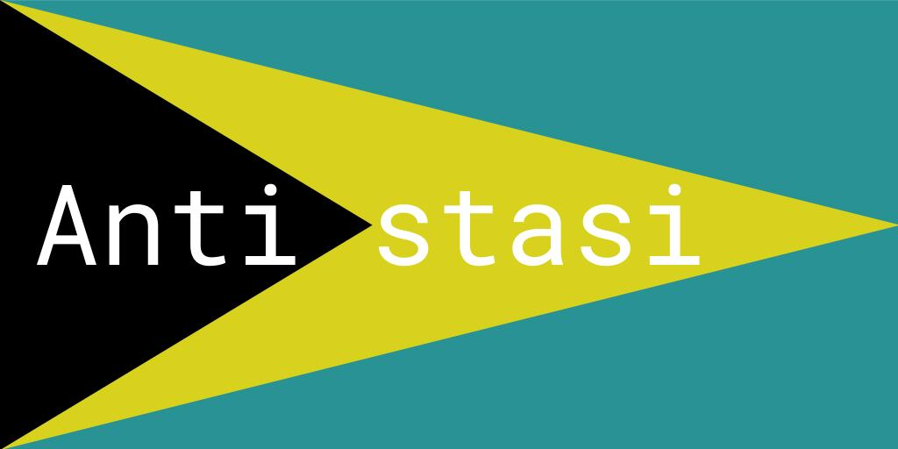

# Golias' Antistasi



This is a modified version of Antistasi scenario for ARMA 3 that deals with some of the issues of the original version.

Antistasi is a scenario where you fight as a guerrilla liberator to flip the island to your side.
This modified version has the same mechanics and the same features but improves some aspects of it.

* Support Altis and Tanoa map
* The arsenal works as expected: weapons that are in the HQ ammo box are available to use.
* Multiple saved games: server/SP can now choose the saved game to load, save, or delete.
* Clients stats are saved in the server and saved when the server is saved.
* The HQ is now fully saved: both items positions (e.g. flag) and new constructions (e.g. sandbags).
* There is no unlocking mechanism: everything is always finite. You lose half of every item if the HQ is destroyed.
* Camps gives access to the arsenal: everything available in the HQ is available in camps (and you can store things there without having them lost).
* All game and performance options, including AI skill and cleanup time, are now modifiable by the commander.
* Revive system works as intended (with or without ACE) and for all factions
* There is no "petros cavalary": this is the commander's responsibility.
* Saving/loading games to files supported.

* Menus were remade from scratch to better accommodate more buttons and other layouts.
* Locations backend was rewritten from scratch.
* Missions backend was rewritten from scratch.
* Spawning is distributed between the server and clients

The code was greatly simplified, cleaned, and reduced for DRY (e.g. for every 1 line added, 2 lines were deleted, I have +4 years experience as professional programmer).

# Installation

To run this mission, take the following steps:

1. Download it from GitHub (green button on the right)
2. copy the directory `Antistasi` (the one *on the same level* as this README) to
the directory `missions` of your profile
3. rename the directory `Antistasi` to `Antistasi.Altis` or `Antistasi.Tanoa`
4. rename the file `mission.altis.sqm` or `mission.tanoa.sqm` to `mission.sqm`
5. open it in Eden editor and export the mission (SP or MP)

# Mod support

* [ACE](https://ace3mod.com/)
* [VCOM](https://forums.bistudio.com/forums/topic/166374-vcom-ai-v20-ai-overhaul/)
* [RHS](http://www.rhsmods.org/)
* [CUP](http://cup-arma3.org/)

# Replacing Factions

This version supports easy replacement of factions. Use the following steps:

1. Duplicate the file `templates/AAF.sqf` (for independents), `templates/NATO.sqf` (for NATO)
or `templates/CSAT.sqf` (for CSAT)
2. Modify the existing fields with your units, vehicles and groups.
3. In the `initialization/common_variables.sqf`, when the files are compiled and called, add a condition to run your files when a condition is met.
4. Load the game with the mod of that faction.

Essentially, our code detects every unit from that faction, and populates
the correct lists with the equipment (weapons, items, vests, etc.) that the units use.
This way, you only need to focus on adding vehicles, groups and units; the remaining is automatic.

# Replacing Worlds

This version supports easy replacement of worlds. Use the following steps:

1. Follow the steps 1-4 of the installation above for Tanoa.
2. Rename the directory `Antistasi.Tanoa` to `Antistasi.[world_name]`
3. Open the mission in editor on the new map and add/remove/position the different markers on the map
4. Duplicate the file `templates/world_altis.sqf` to `templates/world_[world_name].sqf`.
5. Modify the `templates/world_[world_name].sqf` to your taste.
6. Open `initLocations.sqf` and add a new condition, close to the condition `worldName == "Tanoa"`, to use the new template on the new world.

# Development

Development of this mission is easy. We currently only use the following software to do it:

* Arma 3
* A text editor. We recommend [Atom](https://atom.io/) with plugins [language-arma-atom](https://atom.io/packages/language-arma-atom) and [linter-sqf](https://atom.io/packages/linter-sqf) but any will do.
* [DSynchronize](https://dsynchronize.en.softonic.com/), so the development does not occur on an Arma user, but on a directory.
* The version control system [git](https://en.wikipedia.org/wiki/Git)

Steps after installing the software above:

1. Fork this repository on GitHub
2. `git clone` your forked repository to directory SOURCE (e.g. `C:\Users\Golias\Documents\a3Projects\`, e.g. with power shell)
3. open Arma 3 and create a new profile `antistasi_edit`.
4. start DSynchronize and
    1. create a new job
    2. add a source (e.g. `C:\Users\Golias\Documents\a3Projects\Antistasi\Antistasi`)
    3. add a destination (e.g. `C:\Users\Golias\Documents\Arma 3 - Other Profiles\antistasi_edit\missions\Antistasi.Altis`)
    4. tick the option `Save settings on exit`, untick `Bidirectional sync` and tick `realtime sync`
    5. When asked to sync first time, say yes.

Step 4. guarantees that when you modify the source code in directory SOURCE (tracked by git), the files are automatically copied to the destination, and are therefore available to test on Arma 3 Eden editor.

Test that everything works:

1. Open the Eden editor (on profile `antistasi_edit`), and the text editor on directory X.
2. Start the preview. The mission should start as normal.
3. In the file `antistasi/init.sqf`, search for `skipTime`, and delete the line `skipTime random 24` (i.e. make the mission always start at the same time).
4. Save the file. Once you do this, you may open DSynchronize window and confirm that the file `init.sqf` was copied (updated) to the destination.
5. Restart the mission. The mission should have now always started at 6am sharp.

In summary, you modified this version of antistasi and tested it.

Note that if you modify the `mission.sqm` on SOURCE, you will need to load it again in the editor.
`mission.sqm` can be modified in Eden editor for testing, but it is not copied back to SOURCE and will be lost when
you load it again. To change this behavior, tick the box `Bidirectional sync` in DSynchronize.

# Debug tools

Run

```
true call AS_debug_fnc_toggle;
```

to show in the map all units (dead or alive) and locations that are currently spawned.
This helps tracking if CPU is being used unnecessarily. Use `false` to
reverse it.

# Code structure

- `dictionary/`: API for storing serializable data ([README](Antistasi/dictionary/README.md)).
- `database/`: API for loading and saving games ([README](Antistasi/database/README.md)).
- `scheduler/`: API for load-balanced distributed execution ([README](Antistasi/scheduler/README.md)).
- `spawn/`: API for fault-tolerant execution ([README](Antistasi/spawn/README.md)).
- `location/`: API for managing and spawning locations ([README](Antistasi/location/README.md)).
- `mission/`: API for managing and spawning missions ([README](Antistasi/mission/README.md)).
- `movement/`: spawns related to AAF movement spawns (e.g. patrols, attacks).
- `initialization/`: scripts that initialize the mission.
- `medical/`: functions used for the medical system (including ACE)
- `arsenal/`: functions related with weapons, arsenal and boxes.
- `ai_control/`: API to handle AI control.
- `templates/`: templates to modify AS (worlds, items, factions)
- `debug/`: API to debug the mission
- `actions/`: action functions (`addAction`)

## Initialization

Initialization entry point is `init.sqf`. This is called by Arma itself.
This script uses `server.sqf`, `headlessClient.sqf`, `client.sqf` in `initialization/`.

Regardless of the game mode (SP or MP), `server.sqf` is called on the server side
and `client.sqf` or `headlessClient.sqf` are called on non-server.

`server.sqf` call `serverMP.sqf` or `serverSP.sqf` depending

`client.sqf` is responsible for initializing a player. This includes
Event Handling, available actions, etc.

## Persistent and temporary data

This mission has a set of macros and idioms to store data.

Generically, each datum has two attributes:
* shared: whether it is a globally shared
* persistent: whether it is persistently saved

* shared and temporary variables are handled with the macros `AS_S(_key)`, `AS_Sset(_key, _value)`.
* shared and persistent variables are handled with the macros `AS_P(_key)`, `AS_Pset(_key, _value)` or with [dictionaries](Antistasi/dictionary/README.md)
* non-shared temporary variables are handled without any macro.

The [database API](Antistasi/database/README.md) is used to fully serialize (save) and deserialize (load) the mission.

## Distributed execution

This mission has parts (`spawn`s, see below) that can be run by any client.
For these parts, the server acts as a scheduler and load balancer and each client
(headless or not) acts as a worker. See [scheduler](Antistasi/scheduler/README.md) for details.

## Spawn state and execution

The execution of certain parts of this mission is distributed across clients.
This is implemented by the [spawn API](Antistasi/spawn/README.md).

## Locations

Locations are managed by the [location API](Antistasi/location/README.md). They represent
physical locations on the map that are spawned according to certain functionality
and can sometimes be conquered.

### Initialization

When the game is loaded, locations are loaded from the markers in
the `mission.sqm` (`initLocations.sqf`). Specifically, markers starting with a given string
are converted to locations using the following convention

* `"AS_powerplant"`: `"powerplant"`
* `"AS_base"`: `"base"`
* etc.

Cities (`"city"`) and hills (`"hill","hillAA"`) are initialized differently,
see `templates/world_altis.sqf` to learn how.

### Roadblocks

A particular type of location is the roadblock. The roadblocks are placed
on the map during initialization using the markers `"AS_roadblock"` and
from the script `AS_location_fnc_addAllRoadblocks`.
Whenever a location is taken, roadblocks for that location are created/destroyed.

## FIA HQ

The FIA HQ is a location (called `FIA_HQ`) always controlled by FIA.
The following scripts are relevant to change its position:

- `fnc_HQselect.sqf`: client script to choose a position for the HQ
- `fnc_HQplace.sqf`: teleport FIA HQ to a given location (initially-place or rebuild)
- `fnc_HQdeploy.sqf`: places permanent HQ structures in FIA HQ position
- `fnc_HQmove.sqf`: make petros join commander's group and allow the commander to use `fnc_HQbuild.sqf`
- `fnc_HQbuild.sqf`: spawn the FIA HQ in petros current location (move the HQ)

3 different events can cause the HQ to change position:
- initial placement: execute `fnc_HQselect.sqf` which then calls `fnc_HQplace.sqf`
- Commander chooses to move the HQ: execute `fnc_HQmove.sqf` and then `fnc_HQbuild.sqf`
- HQ is destroyed: execute `fnc_HQselect.sqf` which then calls `fnc_HQplace.sqf`

Both `fnc_HQbuild.sqf` and `fnc_HQplace.sqf` call `fnc_HQdeploy.sqf` to position the permanent structures.

The HQ also has objects that can be spawned by the commander. The scripts that handle these are:

- `fnc_HQaddObject.sqf`: adds or delete a HQ object.

Other related functions:

- `persistency/saveFuncs.sqf/AS_hq_fnc_toDict`: persistently save the HQ objects
- `persistency/saveFuncs.sqf/AS_hq_fnc_fromDict`: persistently load the HQ objects
- `AS_fnc_initPetros.sqf`: restart petros (creates a new petros unit)

Related globals:

- `AS_permanent_HQplacements`: all permanent HQ objects (e.g. caja)
- `AS_HQ_placements`: all non-permanent HQ objects (e.g. sandbags)

## Missions

This mission has numerous sub-missions that are spawned automatically or by
a player's decision. See [missions API](Antistasi/mission/README.me) for more details.

## Player's score, rank and eligibility to command

Every player has a score that allows him become commander (`player getVariable "score"`)

The score is modified (increase or decrease) by:
- kill enemies/friends/civilians
- complete/fail missions
- conquer/lose locations

The (server) script that changes a player's score is `orgPlayers/fnc_changePlayerScore.sqf`.

Score defines the rank of the player. Rank is the indicator of the player's score
and is updated on the client side periodically by `Scripts/AS_fnc_activatePlayerRankLoop.sqf` (`player getVariable "rank"`).

Players can decide to become eligible to be commander (`AS_fnc_UI_toggleElegibility`).
Only eligible players can become commanders.
The choice of the commander happens in any of the following situations:

- the commander resigns (`AS_fnc_UI_toggleElegibility`)
- the commander disconnects
- periodically

The script `orgPlayers/fnc_chooseCommander.sqf` makes this choice. When it is called,
players are ranked by score and the highest player with more than 20% of the current commander's score
becomes the new commander. In case the commander resigns or disconnects, the highest scored player becomes
the new commander. Commander is set using `orgPlayers/fnc_setCommander.sqf`.

## Player's money

Every player has money (`player getVariable "money"`) that it can spend to buy vehicles, units, or score.
Players donate money to other players or to FIA (gaining score) via a menu.
The commander can take money from FIA via a menu (losing score).

## Vehicles

Vehicles are bought by FIA or AAF, or are spawned by NATO/CSAT. Afterwards:

- NATO vehicles are locked and can not be sold/stored by FIA.
- AAF/CSAT vehicles are unlocked and can be sold/used by FIA.
- FIA vehicles are unlocked can be sold/used by FIA.
- FIA personal vehicles are locked to others.

### AAF Arsenal

The AAF has an arsenal of vehicles that it buys with AAF money.
The arsenal has different categories of vehicles that are defined in `AAFarsenal.sqf`
and that can be modified in the `templates/` (e.g. for RHS).

## AAF attacks

The AAF attacks from time to time. The relevant variable that controls this is the
`AS_P("secondsForAAFattack")`. This variable is modified via `fnc_changeSecondsForAAFattack`.
The script that starts attacks is the `AS_movement_fnc_sendAAFattack.sqf`. It is run from the loop in `resourcecheck.sqf`
when `AS_P("secondsForAAFattack") == 0`. `AS_movement_fnc_sendAAFattack.sqf` checks whether it is worth to attack
a given location, and, if yes, it spawns the attack accordingly using the missions
`defend_city.sqf`, `defend_camp.sqf` or `defend_location.sqf`.

## Minefields

Minefields are created and destroyed like other locations. The AAF buys
minefields and places them on the map. These can be found by FIA after which
they appear on the map (mines are still hidden and have to be found via mine detectors).
The FIA commander can also create minefields on the map.

Minefields (from both sides) are deleted when they contain no mines (exploded or defused).

Relevant scripts:

* `Create/minefield.sqf`: spawns an existing FIA/AAF minefield
* `Functions/fnc_addMinefield.sqf`: adds a new minefield
* `Functions/fnc_deployAAFminefield.sqf`: tries to find a suitable position and creates an AAF minefield (called by `AS_fnc_spendAAFmoney.sqf`).
* `Functions/fnc_deployFIAminefield.sqf`: interface for the player to choose a position and mine positions to place a minefield (it creates a mission).
* `Missions\establishFIAminefield.sqf`: the mission that creates a FIA minefield

## Actions

Most actions consequences are defined in directory `actions/`.
The list of custom actions is defined in `AS_fnc_addAction`.
To add one of these actions to all players (from server or client) use

```
[[_object,"actionName"],"AS_fnc_addAction"] call BIS_fnc_MP;
```

To add an action to a specific player/client, locally run

```
_object AS_fnc_addAction "actionName";
```

To remove actions, use the same function with the action name `"remove"`.
